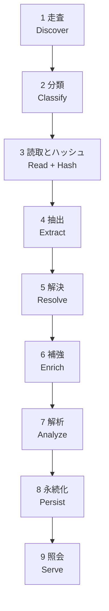

# アーキテクチャ

## 1. 全体像

インデックス生成は 9 段のパイプラインとして構成する。各段は前段の出力のみに依存し、段間はバックプレッシャ付きの有界チャネルで接続する。



| 段 | 入力 | 出力 | 並列性 |
| --- | --- | --- | --- |
| 1 走査 | ルート パス | ファイル エントリ列 | ディレクトリ単位で並列 |
| 2 分類 | ファイル エントリ | 言語・種別付きエントリ | 並列 |
| 3 読取とハッシュ | エントリ | バイト列、内容ハッシュ | 並列 |
| 4 抽出 | ファイル内容 | ファイル ローカルな事実 | 並列、ファイル間で独立 |
| 5 解決 | 全ファイルの事実 | 大域シンボル表、エッジ | 分割並列 + 決定的マージ |
| 6 補強 | グラフ、git 履歴、所有情報 | 追加エッジ | 並列 |
| 7 解析 | グラフ | 中心性、コミュニティ | 反復並列 |
| 8 永続化 | グラフ、解析結果 | セグメントと索引 | 直列書き出し |
| 9 照会 | 生成物 | 部分グラフ | 読み取り専用、並行 |

段 4 までがファイル ローカルで完全並列、段 5 が唯一の大域同期点である。この境界がスケーラビリティを決める。

## 2. 決定性

同一入力から常にバイト単位で同一の成果物を生成する。これは検証可能性・キャッシュ・分散ビルドの前提であり、[要件](requirements.md) の NFR-11 として必須である。

決定性を壊す要因と、その扱いを以下に固定する。

| 要因 | 対策 |
| --- | --- |
| 並列処理の完了順 | 段 5 以降に入る前に、安定キー（正規化パス、次いでバイト位置）で整列する |
| ハッシュ表の反復順 | 出力に関わる走査は必ずソート済み配列を経由する。辞書の列挙順に依存しない |
| 浮動小数点の加算順 | 中心性は固定順序で畳み込み、反復回数と収束閾値を固定する |
| コミュニティ検出の乱数 | 固定シードと固定の探索順序を使う |
| パス表現の差異 | 区切りを `/` に、Unicode を NFC に正規化する |
| タイムスタンプ、絶対パス | 成果物に含めない。含める場合は明示的に版情報として分離する |
| 並列度 | 出力に影響させない。`--jobs` は所要時間のみを変える |

`srcnet verify --deterministic` は同一入力での二重生成を比較し、この不変条件を検査する。
比較は `manifest.json` を含む**全ファイルのバイト列**と相対パスの一覧に対して行う。セグメントの
記述子だけを比べると、診断・オプション・件数・版・プロパティ順といったマニフェストにしか現れない
非決定性を見逃す。

## 3. 並列化とリソース制御

- ワーカー数の既定値はコア数。`--jobs` で上書きする
- 段間チャネルは有界。下流が詰まれば上流が自然に減速する（バックプレッシャ）
- ファイル読み取りは I/O 並列度を別枠で制限し、ランダム I/O の過剰発行を避ける
- ワーカーごとにアリーナを持ち、共有可変状態と `lock` 競合を避ける。結果は決定的な順序でマージする
- すべての段が `CancellationToken` を受け取り、伝播する

### メモリ有界性

全ノードとエッジを同時にメモリへ載せる設計は、規模目標（10^8 〜 10^9 エッジ）で破綻する。したがって次を採る。

- 段 4 の出力は、ワーカー ローカルのバッファが閾値に達するたびに一時セグメントへ書き出す（spill）
- 段 5 のエッジ解決は外部マージ ソートで行い、常駐量を上限内に保つ
- 段 7 の反復解析は、mmap したグラフに対する逐次走査で行い、全体の複製を作らない
- 上限は `--memory-limit` で指定し、既定値は [性能](performance.md) に定める

## 4. モジュール境界

```text
Srcnet.Core          純粋な領域モデル、グラフ表現、ID 計算、決定的アルゴリズム
Srcnet.Text          エンコーディング検出、Unicode 正規化、字句走査、表示幅
Srcnet.Discovery     走査、無視設定、言語分類、読取と内容ハッシュ（段 1〜3）
Srcnet.Extraction    tree-sitter による構文解析と、言語別抽出器・抽出結果の共通表現
Srcnet.Resolution    大域シンボル表とエッジ解決
Srcnet.Storage       セグメント形式、mmap 読み書き、索引、増分管理
Srcnet.Analysis      中心性、コミュニティ検出、コミュニティ命名
Srcnet.Query         検索、探索、予算付き整形
Srcnet.Cli           コマンド解析、進捗表示、終了コード
```

依存は一方向で、下位のモジュールが上位のモジュールを参照する。逆流させない。
`Text` はどのモジュールにも依存せず、`Core` は `Text` の正規化を使う。
`Core` と `Text` は I/O を持たない純粋層で、副作用は `Discovery`、`Storage`、`Cli` の境界に閉じる。

抽出器は共通インターフェイスを実装するが、**プラグインを外部から動的読み込みしない**。対象リポジトリ由来のコードを実行しないという脅威モデル上の制約による（[セキュリティ](security.md)）。

構文解析には tree-sitter を再利用する（[設計判断](decisions.md) ADR-3）。同梱する文法は
コンパイル時に固定した一覧で、対象リポジトリの内容や設定から文法を読み込む経路は持たない。
共有ライブラリが無い環境では構文解析を「利用不可」として扱い、構造グラフの生成は続行する。

## 5. エラーと部分的失敗

超大規模リポジトリでは、一部ファイルの失敗は正常系である。単一ファイルの失敗で全体を中断してはならない。

- ファイル単位の失敗（読み取り不可、権限、壊れた符号化、構文エラー）は診断として記録し、処理を継続する
- 診断は種別ごとに集計し、上限を超えたら要約する。無制限に蓄積しない
- 走査全体が不完全に終わった場合、既存の成果物を上書きしない。`--allow-partial` で明示的に許可されたときのみ上書きする
- **無視規則を読み切れなかった場合も不完全とする。** 適用できなかった規則があると索引対象そのものが確定せず、
  除外すべきものを取り込んだのか、取り込むべきものを落としたのかを成果物から判別できない
- 想定内の失敗は `Result` で表現し、例外は予期しない障害と .NET API 境界に限定する

## 6. 照会の実行モデル

照会は生成物に対する読み取り専用操作であり、書き込み側と独立して動作する。

- 生成物は不変セグメントの集合であるため、インデックス更新中でも既存セグメントの読み取りは安全である
- マニフェストの原子的差し替えによって、読み手は常に一貫したセグメント集合を見る
- 起動時に全体を読み込まず、mmap して必要なページのみを触る。これが起動時間目標の前提になる
