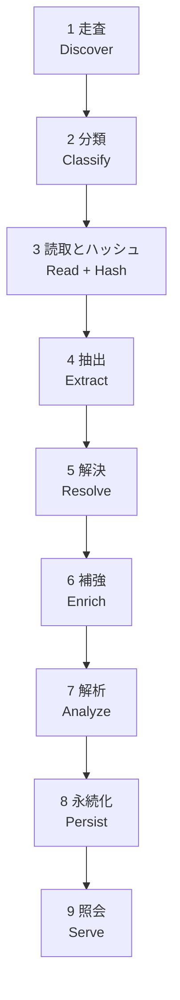

# アーキテクチャ

## 1. 全体像

以下の 9 段は目標アーキテクチャであり、すべてが実装済みではない。
現行は `Discovery.Walk` が段 1〜4 を実行し、CLI では結果を上限付きの保持・退避入力へ渡す。
段 5〜7 は未実装、段 8〜9 は保存と照会として実装済みである。
抽出結果と大きな lookup の spill・外部ソートは実装したが、全パイプラインの常駐メモリ上限の達成は未完了である。



| 段 | 入力 | 出力 | 並列性 |
| --- | --- | --- | --- |
| 1 走査 | ルート パス | ファイル エントリ列 | ディレクトリ単位で並列 |
| 2 分類 | ファイル エントリ | 言語・種別付きエントリ | 並列 |
| 3 読取とハッシュ | エントリ | バイト列、内容ハッシュ | 並列 |
| 4 抽出 | ファイル内容 | ファイル ローカルな事実 | 並列、ファイル間で独立 |
| 5 解決 | 全ファイルの事実 | 大域シンボル表、エッジ | 分割並列 + 決定的マージ |
| 6 補強 | グラフ、git 履歴、所有情報 | 追加エッジ | 並列 |
| 7 解析 | グラフ | 中心性、コミュニティ | 反復並列 |
| 8 永続化 | グラフ、解析結果 | セグメントと索引 | 直列書き出し |
| 9 照会 | 生成物 | 部分グラフ | 読み取り専用、並行 |

段 4 までをファイル ローカルに保ち、段 5 で決定的にマージする設計を目指す。
現行でも Writer の文字列表・ID・CSR 構築には大域処理が残る。

## 2. 決定性

同一入力から常にバイト単位で同一の成果物を生成する。これは検証可能性・キャッシュ・分散ビルドの前提であり、[要件](requirements.md) の NFR-11 として必須である。

決定性を壊す要因と、その扱いを以下に固定する。

| 要因 | 対策 |
| --- | --- |
| 並列処理の完了順 | 段 5 以降に入る前に、安定キー（正規化パス、次いでバイト位置）で整列する |
| ハッシュ表の反復順 | 出力に関わる走査は必ずソート済み配列を経由する。辞書の列挙順に依存しない |
| 浮動小数点の加算順 | 中心性は固定順序で畳み込み、反復回数と収束閾値を固定する |
| コミュニティ検出の乱数 | 固定シードと固定の探索順序を使う |
| パス表現の差異 | 区切りを `/` に、Unicode を NFC に正規化する |
| タイムスタンプ、絶対パス | 成果物に含めない。含める場合は明示的に版情報として分離する |
| 並列度 | 出力に影響させない。`--jobs` は所要時間のみを変える |

`srcnet verify --deterministic` は同一入力での二重生成を比較し、この不変条件を検査する。
比較は `manifest.json` と現行世代を含む**インデックス本体の全ファイルのバイト列**と相対パスの一覧に対して行う。
作業領域、退役待ちの世代、書き込みロック、既定の監査用 `graph.html`、機械固有の `agent-context.json` は除く。
セグメントの
記述子だけを比べると、診断・オプション・件数・版・プロパティ順といったマニフェストにしか現れない
非決定性を見逃す。

## 3. 並列化とリソース制御

現行はワーカー数・走査件数・単一ファイル・抽出結果ごとに上限を持つ。以下のチャネル、
I/O 並列枠、ワーカーアリーナは目標であり、未実装の機構を前提に性能を判断しない。
`WalkOptions.MaxEntries` はファイル数とディレクトリ数それぞれの上限であり、合計数の上限ではない。
どちらかの上限に達した場合やパスを拒否した場合、走査は不完全として報告する。

- ワーカー数の既定値はコア数。`--jobs` で上書きする
- 段間チャネルは有界。下流が詰まれば上流が自然に減速する（バックプレッシャ）
- ファイル読み取りは I/O 並列度を別枠で制限し、ランダム I/O の過剰発行を避ける
- ワーカーごとにアリーナを持ち、共有可変状態と `lock` 競合を避ける。結果は決定的な順序でマージする
- すべての段が `CancellationToken` を受け取り、伝播する

### メモリ有界性

CLI の抽出入力は推定保持量を最大 64 MiB（低予算時はメモリ予算の 1/16）に抑え、超えると binary 退避とパス・offset の外部ソートへ切り替える。
Writer は IReadOnlyList 経由で必要な 1 ファイルを復元する。小さな入力はメモリ内に残し、不要なディスク往復を避ける。
lookup も小規模のメモリ内経路と、上限付きの外部マージ経路を使い分ける。一時ディスクは書き込み前に予算を確認する。

ノード・文字列表・CSR の大域配列、1 ディレクトリの列挙配列、走査キューには入力依存の保持が残る。
`--memory-limit` の managed heap 制限と RSS 監視は失敗時の保護であり、どの入力でも予算内で完了する証拠ではない。
4 GiB の厳密な受け入れと代表入力の性能非劣化は [037](../_drafts/037-memory-bounded-indexing.md) で未完了として扱う。
残る大域表と走査の有界化を M3 / M5 に先行させ、段 5 の参照解決と段 7 の解析自体は別の作業とする。

## 4. モジュール境界

```text
Srcnet.Core          純粋な領域モデル、グラフ表現、ID 計算、決定的アルゴリズム
Srcnet.Text          エンコーディング検出、Unicode 正規化、字句走査、表示幅
Srcnet.Discovery     走査、無視設定、言語分類、読取と内容ハッシュ（段 1〜3）
Srcnet.Extraction    tree-sitter による構文解析と、言語別抽出器・抽出結果の共通表現
Srcnet.Storage       固定長セグメント、mmap 読み取り、CSR、字句索引、検索・探索
Srcnet.Cli           コマンド解析、進捗表示、終了コード
```

`Srcnet.Resolution` / `Srcnet.Analysis` / 独立した `Srcnet.Query` プロジェクトは存在しない。
解決・解析は未実装であり、照会は現在 `Srcnet.Storage.Query`、予算付き整形は CLI に置く。
必要になるまで予定モジュールの空実装を作らない。

依存は一方向で、上位のモジュールが下位のモジュールを参照する。逆流させない。
`Text` はどのモジュールにも依存せず、`Core` は `Text` の正規化を使う。
`Core` と `Text` は I/O を持たない純粋層で、副作用は `Discovery`、`Storage`、`Cli` の境界に閉じる。

抽出器は共通インターフェイスを実装するが、**プラグインを外部から動的読み込みしない**。対象リポジトリ由来のコードを実行しないという脅威モデル上の制約による（[セキュリティ](security.md)）。

構文解析には tree-sitter を再利用する（[設計判断](decisions.md) ADR-3）。同梱する文法は
コンパイル時に固定した一覧で、対象リポジトリの内容や設定から文法を読み込む経路は持たない。
共有ライブラリが無い環境では構文解析を「利用不可」として扱い、構造グラフと T1 の抽出は続行する。

## 5. エラーと部分的失敗

超大規模リポジトリでは、一部ファイルの失敗は正常系である。単一ファイルの失敗で全体を中断してはならない。

- ファイル単位の失敗（読み取り不可、権限、壊れた符号化、構文エラー）は診断として記録し、処理を継続する
- 診断は種別ごとに集計し、上限を超えたら要約する。無制限に蓄積しない
- 走査全体が不完全に終わった場合、既存の成果物を上書きしない。`--allow-partial` で明示的に許可されたときのみ上書きする
- **無視規則を読み切れなかった場合も不完全とする。** 適用できなかった規則があると索引対象そのものが確定せず、
  除外すべきものを取り込んだのか、取り込むべきものを落としたのかを成果物から判別できない
- 想定内の失敗は `Result` で表現し、例外は予期しない障害と .NET API 境界に限定する

## 6. 照会の実行モデル

照会は生成物に対する読み取り専用操作であり、書き込み側と独立して動作する。

- 生成物は不変セグメントの集合であるため、インデックス更新中でも既存セグメントの読み取りは安全である
- マニフェストの原子的差し替えによって、読み手は常に一貫したセグメント集合を見る
- 起動時に全体を読み込まず、mmap して必要なページのみを触る。これが起動時間目標の前提になる
